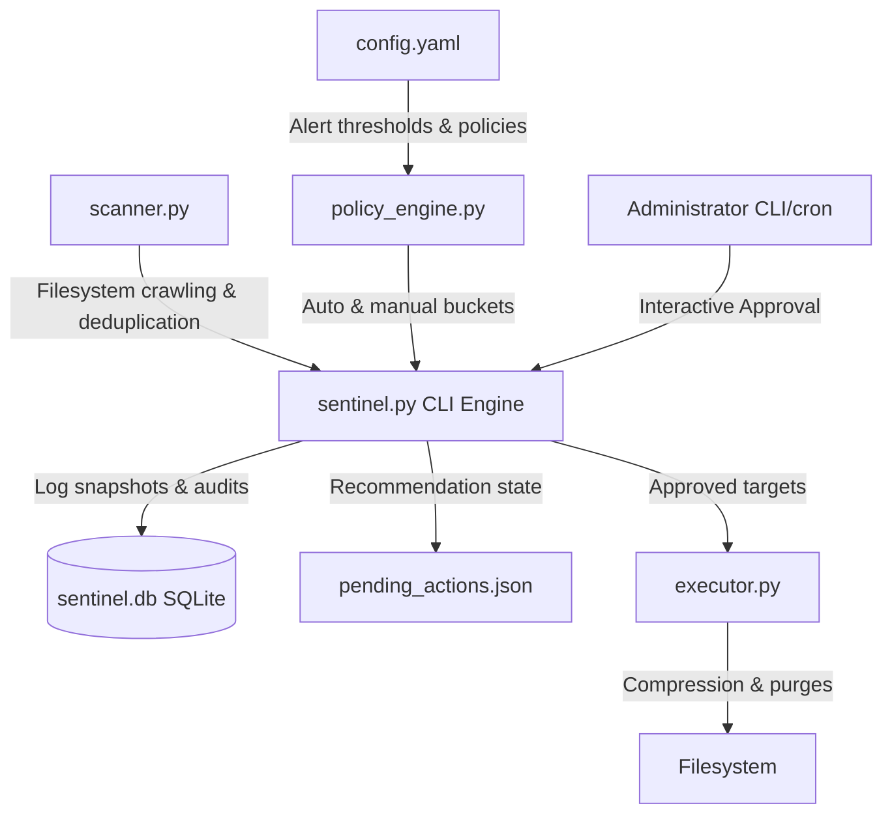

# StorageSentinel - Storage Lifecycle Manager

StorageSentinel is a policy-driven, automated server storage manager designed for research and AI servers. It monitors utilization trends, tracks user growth, and executes automated or administrator-approved cleanup policies to safely resolve disk space issues.

## System Architecture



## System Requirements

- **Operating System**: Linux (CentOS/Ubuntu/Debian)
- **Python**: Python 3.8+ (requires `PyYAML` library)
- **Utilities**: `tar` and `zstd` (for high-performance compression)
- **Permissions**:
  - Scanning user home directories requires read access to `/home`.
  - Running system journal cleanups or reading other user directories requires administrative privileges (`sudo`).

## Installation

1. Clone or copy the `Storage_manager` folder to your target server:
   ```bash
   cd /home/saniya/Downloads/Storage_manager
   ```

2. Install python dependencies:
   ```bash
   pip3 install pyyaml
   ```

3. Ensure system binary packages are installed:
   ```bash
   sudo apt-get install zstd tar sqlite3   # Ubuntu/Debian
   # OR
   sudo dnf install zstd tar sqlite      # CentOS/RHEL
   ```

4. Make the entrypoint executable:
   ```bash
   chmod +x sentinel.sh
   ```

---

## Configuration (`config.yaml`)

Edit the `config.yaml` file to define paths, alert levels, and cleanup policies:

```yaml
# Directory to scan
scan_root: "/home"

# Storage warning thresholds (%)
alert_thresholds:
  warning: 80.0
  critical: 90.0
  emergency: 95.0

# Scanner thresholds
large_file_threshold_gb: 5.0  # Log individual files larger than 5GB
min_dir_size_gb: 1.0          # Log directories larger than 1GB for historical analysis
cold_data_days: 180           # Days since modification to consider directory "cold"

# Auto-cleanup rules
auto_cleanup:
  trash_max_age_days: 30       # Empty user trash files older than 30 days
  clean_conda_cache: true      # Run 'conda clean --all' if warning threshold hit
  clean_pip_cache: true        # Run 'pip cache purge' if warning threshold hit
  clean_journald_logs: true    # Vacuum journald logs older than 30 days
  journald_max_age_days: 30

# Excluded folders / filenames (exact paths or basenames)
exclusions:
  - "/proc"
  - "/sys"
  - "/dev"
  - ".git"
  - "node_modules"
  - "venv"
  - ".venv"
```

---

## Command Reference

StorageSentinel is managed using `sentinel.sh`.

### 1. Perform File System Scan
Recursively scans the filesystem root, calculates user distribution, groups duplicates, identifies cold directories, logs data to SQLite database, and prints a summary report:
```bash
./sentinel.sh scan
```
- **Override root directory**: `./sentinel.sh scan --root /var`
- **Output**: Generates/updates `./pending_actions.json` listing recommended actions.

### 2. Interactive Approval Flow
Allows administrators to approve or reject recommendations:
```bash
./sentinel.sh approve
```
Administrators can navigate findings interactively:
- `y`: Approve target for cleanup / archival.
- `n`: Reject action (it will not be shown again).
- `s`: Skip action (keep it pending).
- `q`: Save decisions and exit.

### 3. Execute Cleanups
Runs the cleanup commands for approved recommendations:
```bash
./sentinel.sh clean
```
- **Dry-Run (Simulation)**: `./sentinel.sh clean --dry-run` (prints proposed actions without mutating files)
- **Auto-Only**: `./sentinel.sh clean --auto-only` (runs safe automated cache/trash purges, bypassing manual approvals)

### 4. History and Trend Analysis
Displays historical storage snapshot log and growth analytics (compares latest two scans to show directory and user usage growth rates):
```bash
./sentinel.sh history
```

---

## Safety Features

- **Double-Stage Compression Verification**: Before deleting any cold directory, `executor.py` compresses it to `.tar.zst` and runs `zstd -d -c | tar -tf` to verify archive integrity. If verification fails, the original directory is preserved.
- **Deduplication Safeguards**: Grouping duplicates requires matching file sizes followed by partial (first 1MB) and full content MD5 hashing. The original is explicitly kept; only duplicate paths are removed.
- **Trash Preservation**: Preserves the structural desktop wrapper folders (`files` and `info` inside user Trash), deleting only the actual discarded files inside them.

---

## Production Deployment (Automation)

To automate server storage management, you can schedule scans and runs.

### Option A: Cron Schedule (Recommended)
Add a root cron job to perform scanning and automated cache cleanups daily, alerting administrators via logs.

1. Open crontab:
   ```bash
   sudo crontab -e
   ```

2. Add the following entries:
   ```cron
   # Run scan daily at 2:00 AM, updating recommendations and system usage tables
   0 2 * * * cd /home/saniya/Downloads/Storage_manager && ./sentinel.sh scan >> /var/log/sentinel_scan.log 2>&1

   # Execute safe auto-cleanups (e.g. caches) daily at 3:00 AM
   0 3 * * * cd /home/saniya/Downloads/Storage_manager && ./sentinel.sh clean --auto-only >> /var/log/sentinel_clean.log 2>&1
   ```

### Option B: Systemd Timers
Create a systemd service to run scans automatically.

1. Create service file `/etc/systemd/system/sentinel-scan.service`:
   ```ini
   [Unit]
   Description=StorageSentinel filesystem scanner
   After=network.target

   [Service]
   Type=oneshot
   WorkingDirectory=/home/saniya/Downloads/Storage_manager
   ExecStart=/usr/bin/python3 sentinel.py scan

   [Install]
   WantedBy=multi-user.target
   ```

2. Create timer file `/etc/systemd/system/sentinel-scan.timer`:
   ```ini
   [Unit]
   Description=Run StorageSentinel scan daily

   [Timer]
   OnCalendar=daily
   Persistent=true

   [Install]
   WantedBy=timers.target
   ```

3. Enable timer:
   ```bash
   sudo systemctl daemon-reload
   sudo systemctl enable --now sentinel-scan.timer
   ```
