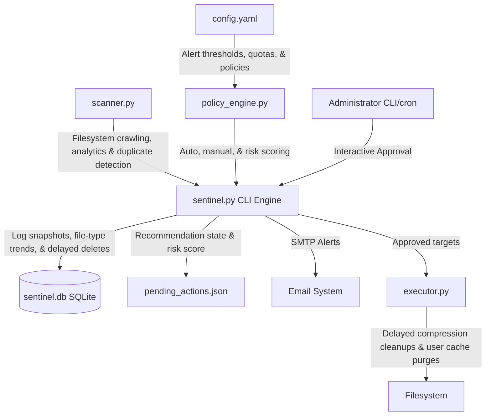

# StorageSentinel - Storage Lifecycle Manager

StorageSentinel is a policy-driven, automated server storage manager designed for research and AI servers. It monitors utilization trends, tracks user growth and quotas, performs file type analytics, and executes automated or administrator-approved cleanup policies to safely resolve disk space issues.

## System Architecture



## Production Safety Safeguards

StorageSentinel is built around the philosophy of **Observe → Analyze → Recommend → Approve → Execute**. It includes strict safeguards to prevent server disruption:

1. **SHA256 Content Matching**: File deduplication uses secure SHA256 checksums (partial first 1MB, then full file hash) to prevent hash collisions.
2. **Strictly Manual Deduplication & Cache Purges**: Duplicate file removal and Python user cache purges (Conda / Pip) are never executed automatically. They require explicit administrator approval in the recommendation queue.
3. **User-Specific Cache Purges**: Conda cache purges are separated by cache directory, and on Unix environments they are executed under the respective user's permissions (`sudo -u <username>`) rather than globally as root.
4. **Delayed Compression Deletion (7-Day Safety Valve)**: When a directory compression action is approved and executed:
   - The directory is compressed to a `.tar.zst` archive.
   - Archive integrity is verified by simulating decompression.
   - If verified, the original directory is renamed to `.deletable.YYYY-MM-DD` and registered as a pre-approved `delayed_delete` action.
   - The original files are kept for 7 days before being automatically purged during a subsequent `clean` run.
5. **Protected Paths & Databases (Hard Guarantee)**: Paths listed under `protected_paths` (e.g. `/var/lib/postgresql`, `/var/lib/mysql`, `/etc`, `/boot`) and live database files (`.db`, `.sqlite`, `.sqlite3`, via `protected_extensions`) are never compressed, archived, or deleted. Recommendations for them are suppressed by the policy engine, and the executor refuses to act on them even if they are somehow approved. Critical-risk actions are likewise never recommended.

## System Requirements

- **Operating System**: Linux (CentOS/Ubuntu/Debian) or Windows (for development/testing)
- **Python**: Python 3.8+ (requires `PyYAML` library)
- **Utilities**: `tar` and `zstd` (for high-performance compression on Linux)
- **Permissions**:
  - Scanning user home directories requires read access to `/home`.
  - Running system journal cleanups or reading other user directories requires administrative privileges (`sudo`).

## Installation

1. Clone or copy the `StorageSentinel` folder to your target server:
   ```bash
   cd /home/saniya/Downloads/Storage_manager
   ```

2. Install python dependencies:
   ```bash
   pip3 install pyyaml
   ```

3. Ensure system binary packages are installed:
   ```bash
   sudo apt-get install zstd tar sqlite3   # Ubuntu/Debian
   # OR
   sudo dnf install zstd tar sqlite      # CentOS/RHEL
   ```

4. Make the entrypoint executable:
   ```bash
   chmod +x sentinel.sh
   ```

---

## Configuration (`config.yaml`)

Edit the `config.yaml` file to define paths, alert levels, user quotas, and email settings:

```yaml
# Directory to scan
scan_root: "/home"

# Storage warning thresholds (%)
alert_thresholds:
  warning: 80.0
  critical: 90.0
  emergency: 95.0

# Scanner thresholds
large_file_threshold_gb: 5.0  # Log individual files larger than 5GB
min_dir_size_gb: 1.0          # Log directories larger than 1GB for historical analysis
cold_data_days: 180           # Days since modification/access to consider directory "cold"

# Auto-cleanup rules (only for low-risk actions)
auto_cleanup:
  trash_max_age_days: 30       # Empty user trash files older than 30 days
  clean_conda_cache: true      # Flag conda cache for manual recommendations
  clean_pip_cache: true        # Flag pip cache for manual recommendations
  clean_journald_logs: true    # Vacuum journald logs older than 30 days
  journald_max_age_days: 30

# Excluded folders / filenames (exact paths or basenames)
exclusions:
  - "/proc"
  - "/sys"
  - "/dev"
  - ".git"
  - "node_modules"
  - "venv"
  - ".venv"

# Protected paths & databases (never compressed/archived/deleted)
protected_paths:
  - "/var/lib/postgresql"
  - "/var/lib/mysql"
  - "/etc"
  - "/boot"
protected_extensions:
  - ".db"
  - ".sqlite"
  - ".sqlite3"

# User quota settings
# Map specific users to their classes
user_classes:
  sines: faculty
  alavia: phd
  student: student

# Space quota values in Gigabytes (GB)
quotas:
  default: 150.0
  faculty: 500.0
  phd: 300.0
  student: 150.0

# SMTP email alerts configuration
email_alerts:
  enabled: true
  smtp_server: "localhost"
  smtp_port: 25
  from_address: "sentinel@yourdomain.com"
  to_addresses:
    - "admin@yourdomain.com"
```

---

## Command Reference

StorageSentinel is managed using `sentinel.sh`.

### 1. Perform File System Scan
Recursively scans the filesystem root, calculates user distribution, checks quotas, classifies file types, groups duplicates, identifies cold directories, logs data to SQLite database, sends SMTP warning email if threshold exceeded, and prints a summary report:
```bash
./sentinel.sh scan
```
- **Override root directory**: `./sentinel.sh scan --root /var`
- **Output**: Generates/updates `./pending_actions.json` listing recommended actions.

### 2. Interactive Approval Flow
Allows administrators to approve or reject recommendations:
```bash
./sentinel.sh approve
```
Administrators can navigate findings interactively:
- `y`: Approve target for cleanup / archival.
- `n`: Reject action (it will not be shown again).
- `s`: Skip action (keep it pending).
- `q`: Save decisions and exit.

### 3. Execute Cleanups
Runs the cleanup commands for approved recommendations and automatically purges 7-day-old compressed originals:
```bash
./sentinel.sh clean
```
- **Dry-Run (Simulation)**: `./sentinel.sh clean --dry-run` (prints proposed actions without mutating files)
- **Auto-Only**: `./sentinel.sh clean --auto-only` (runs safe automated cache/trash purges, bypassing manual approvals and delayed deletes)

### 4. History and Trend Analysis
Displays historical storage snapshot log and growth analytics:
```bash
./sentinel.sh history
```

---

## Report Sections

1. **Filesystem Utilization**: Total, used, available, and percentage disk usage with alert statuses.
2. **User Storage & Quotas**: Displays user disk usage compared to quota limits and status (`OK` or `Exceeded`).
3. **File Type Analytics**: Aggregated size of file categories:
   - **Videos**: Media files (`.mp4`, `.mkv`, etc.)
   - **ISOs**: System disk images (`.iso`, `.img`, etc.)
   - **AI Models**: Neural weights and model definitions (`.bin`, `.pt`, `.safetensors`, `.gguf`, etc.)
   - **Databases**: Live databases (`.db`, `.sqlite`, `.sqlite3`) — protected from deletion/compression.
   - **Datasets**: Data structures (`.csv`, `.json`, `.parquet`, `.xml`, etc.)
   - **Caches**: Package manager and general cache systems.
   - **Trash**: Discarded user files.
   - **Other**: Remaining files.
4. **Large Files (>5 GB)**: Details on massive files, listing owners and last access dates.
5. **Duplicate File Summary**: Lists duplicate files with potential savings, detailing owners.
6. **Recommended Cleanup Candidates**: Low-risk automatic and manual approval actions, labeled with Risk Scores (`Low`, `Medium`, `High`, `Critical`).

---

## Production Deployment (Automation)

Add a root cron job to perform scanning and automated cache cleanups daily, alerting administrators via logs.

1. Open crontab:
   ```bash
   sudo crontab -e
   ```

2. Add the following entries:
   ```cron
   # Run scan daily at 2:00 AM, updating database and sending email alerts
   0 2 * * * cd /home/saniya/Downloads/Storage_manager && ./sentinel.sh scan >> /var/log/sentinel_scan.log 2>&1

   # Execute safe auto-cleanups and due delayed deletions daily at 3:00 AM
   0 3 * * * cd /home/saniya/Downloads/Storage_manager && ./sentinel.sh clean --auto-only >> /var/log/sentinel_clean.log 2>&1
   ```
