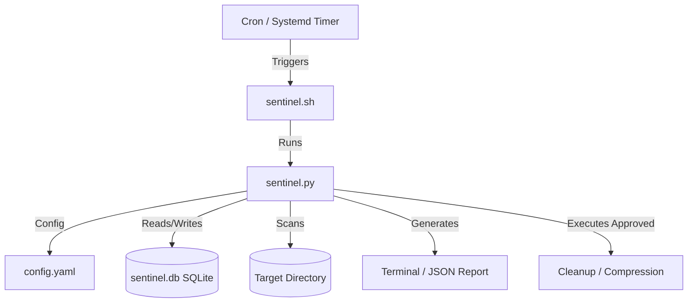

# Implementation Plan - StorageSentinel: Automated Server Storage Lifecycle Management System

This document outlines the design and implementation details for **StorageSentinel**, a production-grade, policy-driven storage auditing and lifecycle management system. It ensures high visibility into server disk usage, tracks historical trends using a local SQLite database, and automates low-risk cleanup tasks while ensuring that critical research datasets, models, or databases are never deleted without explicit administrator approval.

---

## User Review Required

> [!IMPORTANT]
> **Safety First Policy**: By default, no research data, user projects, or database directories will be deleted automatically. 
> - **Auto-cleanup** is strictly limited to ephemeral system caches (Conda package caches, pip cache, journald logs beyond 30 days, and local Trashes older than 30 days).
> - **Archival or deletion** of research directories (`Arslan_PHD`, `Llama-2-*`, datasets) will *always* generate a pending recommendation and require explicit administrator approval before execution.

---

## Open Questions

> [!IMPORTANT]
> 1. **Scan Root Path & Testing**: Should the script support scanning a configurable root directory (e.g. `scan_root: /home`) in `config.yaml` so we can test it locally on a dummy directory (e.g., `./test_env/`) first?
> 2. **Sudo Permissions**: Some actions (like cleaning journald logs or scanning other users' private home directories) require root privileges. Should the tool run under `sudo`? If run without `sudo`, it will scan what it has access to and skip system actions, logging warnings.
> 3. **Approval Mechanism**: Do you prefer an interactive command-line interface (e.g., `./sentinel.sh approve` showing a prompt for each recommendation) or editing `pending_actions.json` directly (changing `"approved": false` to `true`)? We propose implementing both: a CLI command that walks you through them, plus the option to edit the JSON manually.

---

## Proposed Changes

We will implement the StorageSentinel system in `/home/saniya/Downloads/Storage_manager/` as a modular Python package with a simple shell wrapper.

### 1. Configuration & Policies
#### [NEW] [config.yaml](file:///home/saniya/Downloads/Storage_manager/config.yaml)
Defines scan paths, thresholds, and policy parameters.
- **Alert Thresholds**: Warning (80% disk usage), Critical (90%), Emergency (95%).
- **Rules**:
  - `trash`: Auto-delete files in `.local/share/Trash` older than 30 days.
  - `system_caches`: Clean conda packages, pip cache, and journald logs if space is low.
  - `large_files`: Define large files threshold (e.g. > 5 GB).
  - `cold_data`: Identify folders untouched (no access/modification) for > 180 days.
  - `exclusions`: Paths to completely ignore during scanning (e.g. `/proc`, `/sys`, `.git`).

### 2. Database Schema & Logging
#### [NEW] [database.py](file:///home/saniya/Downloads/Storage_manager/database.py)
Manages the SQLite database `sentinel.db` to record metrics for trend analysis.
- **Table `system_scans`**: `id`, `timestamp`, `total_size_gb`, `used_size_gb`, `free_size_gb`, `percent_used`.
- **Table `user_usage`**: `id`, `scan_id`, `username`, `used_size_gb`.
- **Table `directory_usage`**: `id`, `scan_id`, `path`, `size_gb`, `last_modified`.
- **Table `large_files`**: `id`, `scan_id`, `path`, `size_gb`, `owner`, `last_accessed`.
- **Table `pending_actions`**: `id`, `timestamp`, `action_type` (e.g., delete, compress), `target_path`, `size_gb`, `approved`, `executed`, `execution_timestamp`.

### 3. File System Scanner
#### [NEW] [scanner.py](file:///home/saniya/Downloads/Storage_manager/scanner.py)
Recursive file system scanner optimized using `os.scandir`.
- Computes overall directory sizes.
- Finds files exceeding `large_file_threshold_gb`.
- Detects potential duplicate files:
  - Groups files by exact size.
  - For files matching size, computes a fast partial hash (first 1MB) and then a full MD5 hash if the partial match succeeds, avoiding hashing large unique files completely.

### 4. Policy Engine & Action Reporter
#### [NEW] [policy_engine.py](file:///home/saniya/Downloads/Storage_manager/policy_engine.py)
Applies config rules to the scanned data.
- Categorizes paths into:
  - `SAFE_AUTO`: System caches and expired Trash.
  - `RECOMMENDED_ACTION`: Cold directories, large duplicate files, unneeded installer files.
  - `HIGH_RISK_KEEP`: Actively modified research datasets.
#### [NEW] [reporter.py](file:///home/saniya/Downloads/Storage_manager/reporter.py)
- Formats and prints a beautiful terminal dashboard.
- Saves pending recommendations to `pending_actions.json`.

### 5. Cleanup Executor & CLI
#### [NEW] [executor.py](file:///home/saniya/Downloads/Storage_manager/executor.py)
Executes approved operations safely:
- Conda cleaning (`conda clean --all -y`).
- Pip cache purge (`pip cache purge`).
- Vacuum journald logs (`journalctl --vacuum-time=30d`).
- Compress directories using `tar -cf - <dir> | zstd -o <dir>.tar.zst` (high-performance compression), verifying archive integrity before removing original files.
- Trash emptying for files older than 30 days.
#### [NEW] [sentinel.py](file:///home/saniya/Downloads/Storage_manager/sentinel.py)
The central python controller importing all modules, exposing CLI arguments:
- `scan`: Runs scan, saves to SQLite DB, creates `pending_actions.json`, and prints report.
- `approve`: Interactive step-by-step CLI to approve or reject actions.
- `clean`: Executes approved cleanups and safe automatic actions.
- `history`: Query SQLite DB and print usage trends and growth rates.
#### [NEW] [sentinel.sh](file:///home/saniya/Downloads/Storage_manager/sentinel.sh)
Bash wrapper script to handle virtual environment setup, executable permissions, and convenience commands.

---

## Verification Plan

### Automated Tests
We will build a verification script `test_sentinel.py` inside a `tests/` directory:
- Creates a mock workspace (`./test_env/`) containing dummy user home directories, fake cache files, fake large duplicate files, and fake "active research" folders.
- Runs `sentinel.py scan --root ./test_env/` to verify files are scanned correctly.
- Asserts that SQLite databases are populated and correct.
- Runs `sentinel.py approve` programmatically or verifies that the JSON is written correctly.
- Runs `sentinel.py clean --root ./test_env/` and asserts that caches and approved files are deleted/compressed, and unapproved files remain untouched.

### Manual Verification
- Run `./sentinel.sh scan` on the actual workspace and review the output formatting.
- Walk through the interactive approval prompt `./sentinel.sh approve`.
